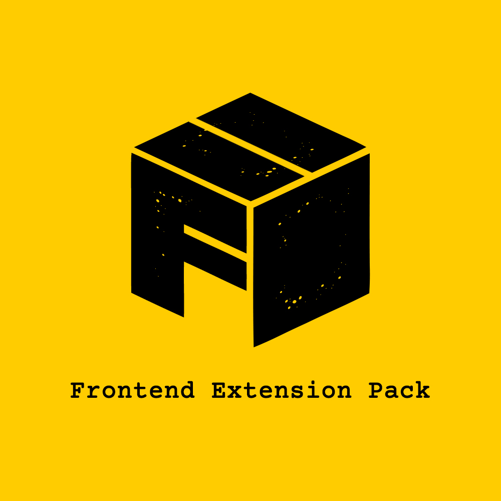
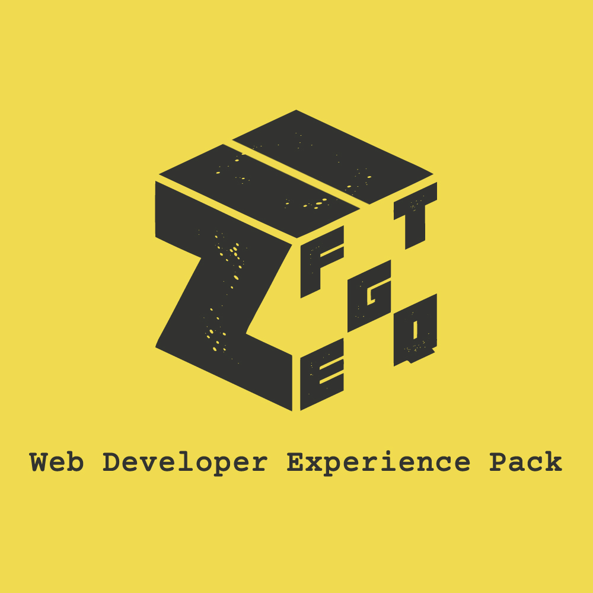

# Frontend Essentials Extension Pack (FPack)

### FPack

Frontend Development Essentials Extension Pack for Visual Studio Code

## Extensions Included

- 1- [HTMLHint](https://marketplace.visualstudio.com/items?itemName=mkaufman.htmlhint) - VS Code integration for HTMLHint - A Static Code Analysis Tool for HTML

- 2- [HTML CSS Support](https://marketplace.visualstudio.com/items?itemName=ecmel.vscode-html-css) - CSS Intellisense for HTML

- 3- [Auto Rename Tag](https://marketplace.visualstudio.com/items?itemName=formulahendry.auto-rename-tag) - Auto rename paired HTML/XML tag.

- 4- [Color Highlight](https://marketplace.visualstudio.com/items?itemName=naumovs.color-highlight) - Highlight web colors in your editor

- 5- [Color Info](https://marketplace.visualstudio.com/items?itemName=bierner.color-info) - Provides quick information about css colors

- 6- [Color Manager](https://marketplace.visualstudio.com/items?itemName=RoyAction.color-manager) - color picker and color palette

- 7- [CSS Navigation](https://marketplace.visualstudio.com/items?itemName=pucelle.vscode-css-navigation) - Allows Go to Definition from HTML to CSS / Sass / Less; provides Completion and Workspace Symbols for class & id name.

- 8- [Image preview](https://marketplace.visualstudio.com/items?itemName=kisstkondoros.vscode-gutter-preview) - Shows image preview in the gutter and on hover.

- 9- [Live Server](https://marketplace.visualstudio.com/items?itemName=formulahendry.ritwickdey.liveserver) - Launch a development local Server with live reload feature for static & dynamic pages

- 10- [Static server](https://marketplace.visualstudio.com/items?itemName=axetroy.vscode-static-server) - Serve your static directory

- 11- [file-size](https://marketplace.visualstudio.com/items?itemName=zh9528.file-size) - Show the current text file size in the status bar.

## Recommended Extension pack

[ZPack](https://marketplace.visualstudio.com/items?itemName=SeyyedKhandon.zpack) is An Opinionated collection of the `best` and `most` used extensions for Web Developers in VSCode which has Better `Developer Experience(DX)` and `load time` in Mind.

## Relevant Links

- [Github](https://github.com/SeyyedKhandon/fpack)
- [VS Code Marketplace](https://marketplace.visualstudio.com/items?itemName=SeyyedKhandon.fpack)

**Enjoy!**
